Fajar Arif Riyanto  
311910666  
TI 19 B2

1. Membuat dokumen HTML dan mencoba tag javascript.     
   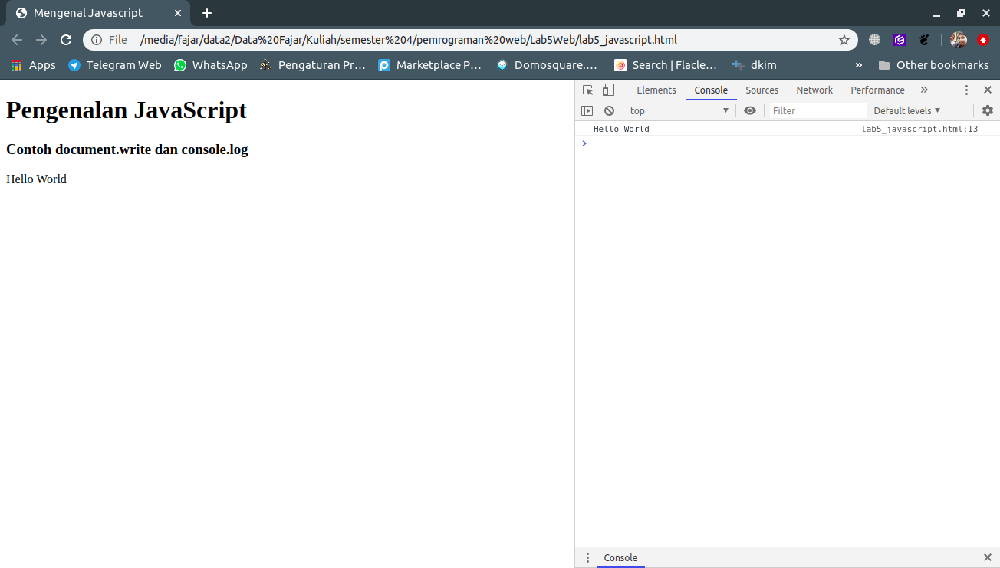  

2. Mencoba window alert dengan javascript.  
    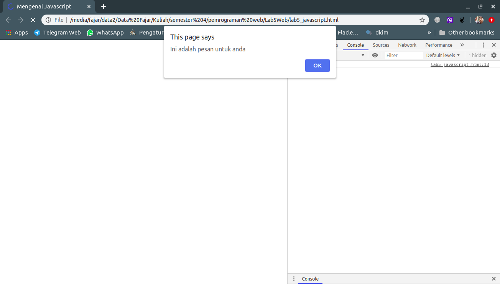

3. Membuat window prompt dengan javascript.    
    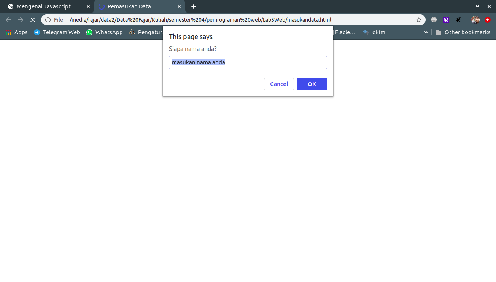

4. Membuat fungsi dengan body onload.  
     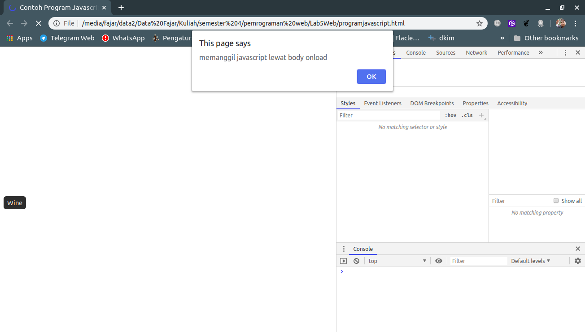

5. Fungsi dasar aritmatika dalam javascript.  
    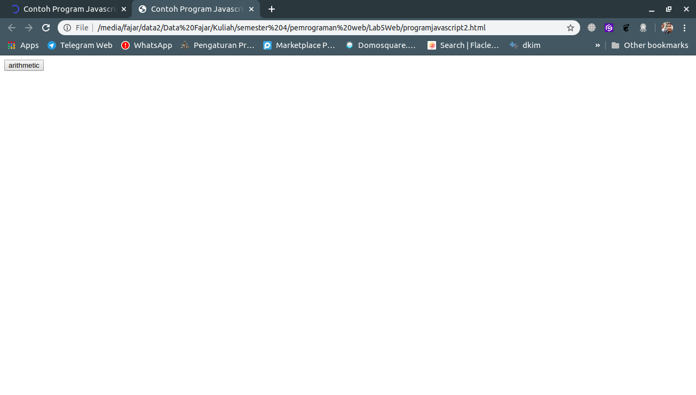  
    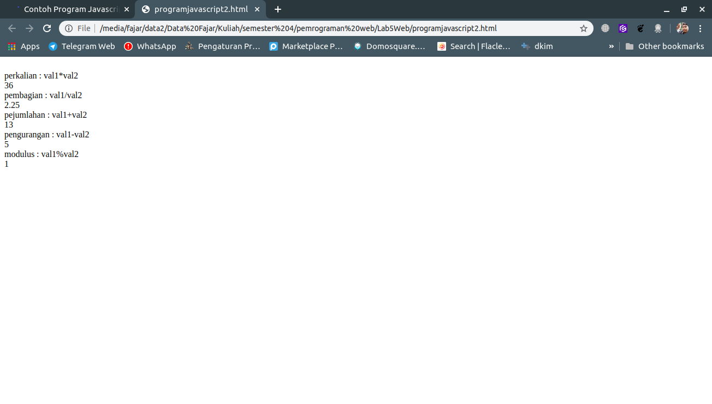

6. Penggunaan Kondisi if dan else.  
    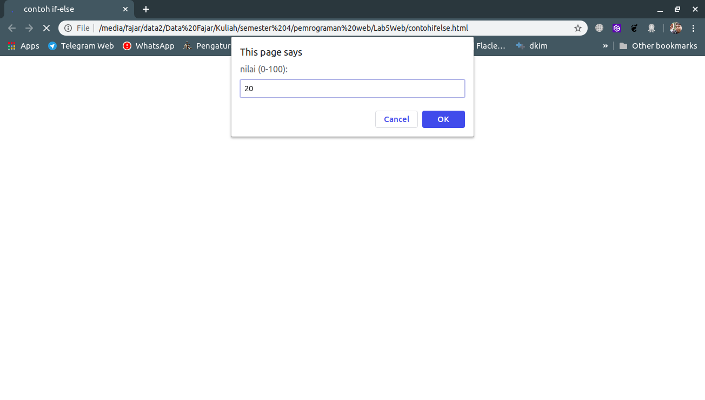  
    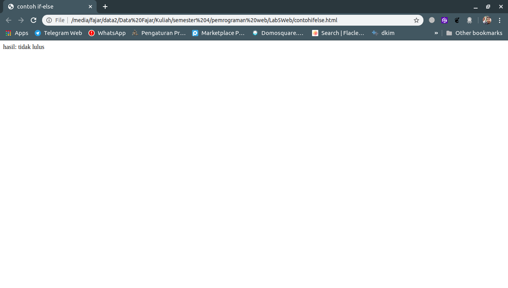 

7. Penggunaan switch untuk seleksi kondisi.  
    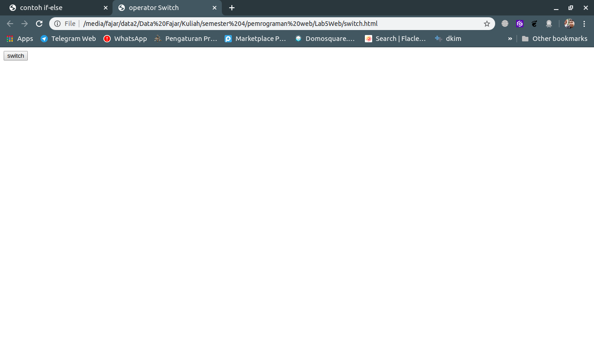  
       
    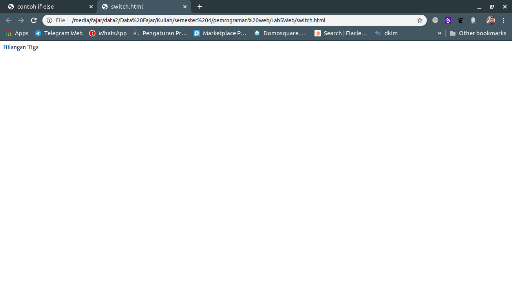   

8. Membuat form input.  
    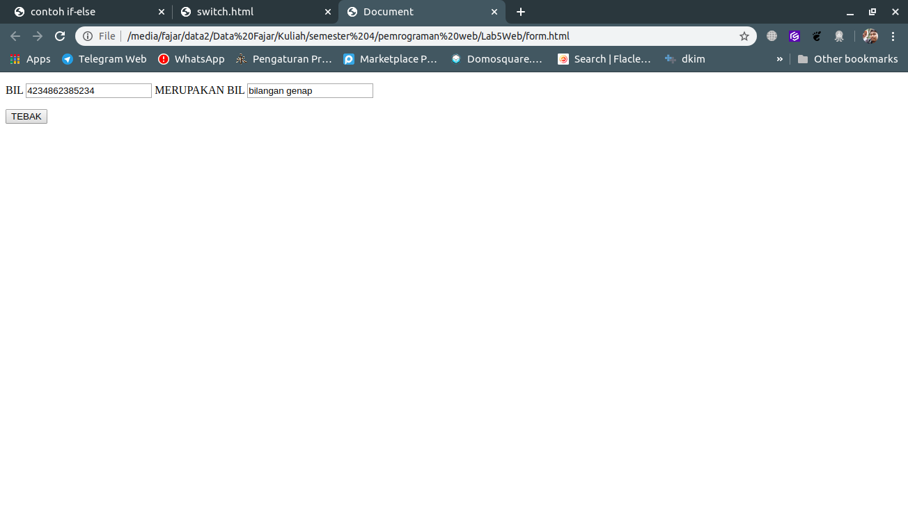

9. Membuat form button dengan javascript.
      

10. Membuat HTML dom.
    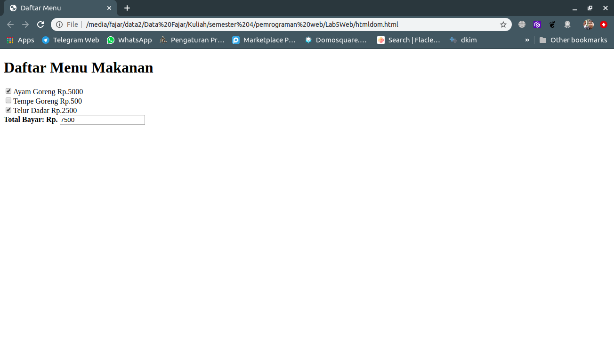 

   
TUGAS
1. Membuat Validasi pada isian form. Saya membuat file baru dengan nama validasiinput.html, dan berikut adalah hasilnya.

    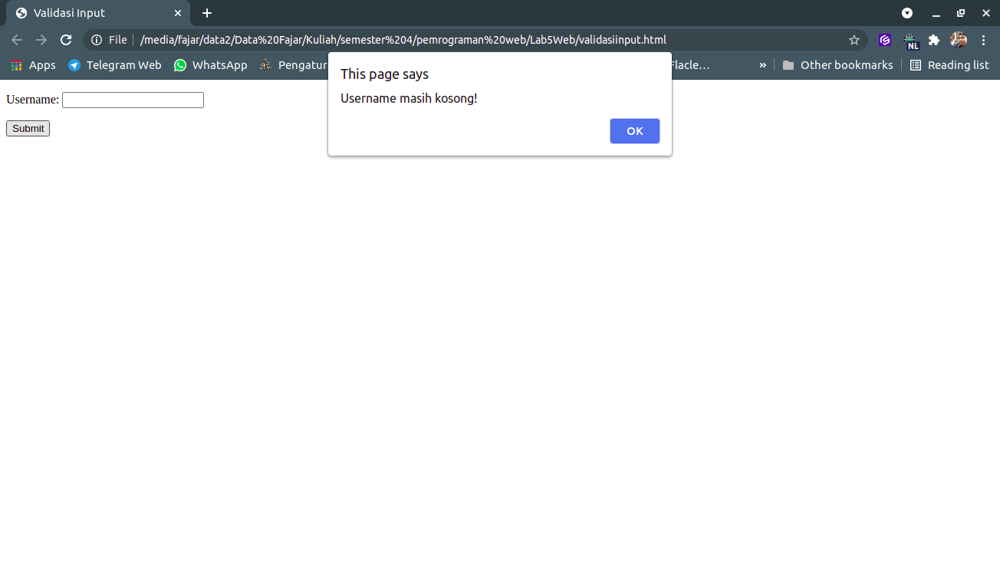 

